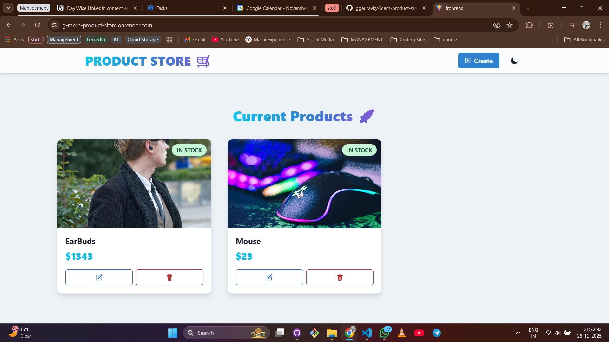
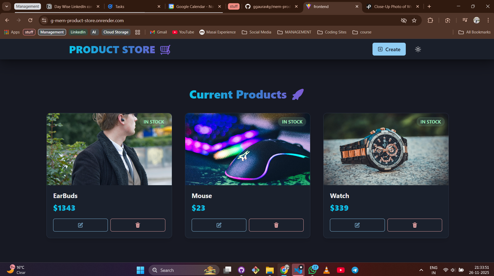

# 🛒 MERN Product Store

<div align="center">


**A modern, full-stack product management application built with the MERN stack**

[🚀 Live Demo](https://g-mern-product-store.onrender.com/) | [📖 Documentation](#features) | [🐛 Report Bug](https://github.com/ggauravky/mern-product-store/issues)

</div>

---

## ✨ Features

- ✅ **Create, Read, Update, Delete** products with ease
- 🎨 **Beautiful UI** with smooth animations using Framer Motion
- 🌓 **Dark/Light Mode** toggle for better user experience
- 📱 **Fully Responsive** design that works on all devices
- ⚡ **Real-time Updates** with optimistic UI updates
- 🔐 **MongoDB Database** for secure data storage
- 🎭 **Modern Design** with Chakra UI components

---

## 🛠️ Tech Stack

### Frontend

- 
- 
- 
- 
- 
- 

### Backend

- 
- 
- 
- 

---

## 🚀 Quick Start

### Prerequisites

- Node.js (v14 or higher)
- MongoDB Atlas account
- Git

### Installation

1. **Clone the repository**

   ```bash
   git clone https://github.com/ggauravky/mern-product-store.git
   cd mern-product-store
   ```

2. **Install dependencies**

   ```bash
   # Install backend dependencies
   npm install

   # Install frontend dependencies
   cd frontend
   npm install
   cd ..
   ```

3. **Set up environment variables**

   Create a `.env` file in the root directory:

   ```env
   MONGO_URI=your_mongodb_connection_string
   PORT=5000
   ```

4. **Run the application**

   ```bash
   # Development mode (backend only)
   npm run dev

   # Run frontend separately
   cd frontend
   npm run dev
   ```

5. **Build for production**
   ```bash
   npm run build
   npm start
   ```

---

## 📁 Project Structure

```
mern-product-store/
├── backend/
│   ├── config/
│   │   └── db.js              # MongoDB connection
│   ├── controllers/
│   │   └── product.controllers.js
│   ├── models/
│   │   └── product.model.js
│   ├── routes/
│   │   └── product.route.js
│   └── server.js              # Express server
├── frontend/
│   ├── src/
│   │   ├── components/
│   │   │   ├── Navbar.jsx
│   │   │   └── ProductCard.jsx
│   │   ├── pages/
│   │   │   ├── HomePage.jsx
│   │   │   └── CreatePage.jsx
│   │   ├── store/
│   │   │   └── product.js     # Zustand state management
│   │   ├── App.jsx
│   │   └── main.jsx
│   └── package.json
├── .env
├── package.json
└── README.md
```

---

## 🎨 Screenshots

### Light Mode


Modern, clean interface with smooth animations and gradient effects.

### Dark Mode


Eye-friendly dark theme for comfortable night-time browsing.

---

## 🌐 API Endpoints

| Method | Endpoint            | Description          |
| ------ | ------------------- | -------------------- |
| GET    | `/api/products`     | Get all products     |
| POST   | `/api/products`     | Create a new product |
| PUT    | `/api/products/:id` | Update a product     |
| DELETE | `/api/products/:id` | Delete a product     |

---

## 🤝 Contributing

Contributions are welcome! Please feel free to submit a Pull Request.

1. Fork the project
2. Create your feature branch (`git checkout -b feature/AmazingFeature`)
3. Commit your changes (`git commit -m 'Add some AmazingFeature'`)
4. Push to the branch (`git push origin feature/AmazingFeature`)
5. Open a Pull Request

---

## 📝 License

This project is licensed under the ISC License - see below for details:

```
ISC License

Copyright (c) 2025 Gaurav Kumar

Permission to use, copy, modify, and/or distribute this software for any
purpose with or without fee is hereby granted, provided that the above
copyright notice and this permission notice appear in all copies.

THE SOFTWARE IS PROVIDED "AS IS" AND THE AUTHOR DISCLAIMS ALL WARRANTIES
WITH REGARD TO THIS SOFTWARE INCLUDING ALL IMPLIED WARRANTIES OF
MERCHANTABILITY AND FITNESS. IN NO EVENT SHALL THE AUTHOR BE LIABLE FOR
ANY SPECIAL, DIRECT, INDIRECT, OR CONSEQUENTIAL DAMAGES OR ANY DAMAGES
WHATSOEVER RESULTING FROM LOSS OF USE, DATA OR PROFITS, WHETHER IN AN
ACTION OF CONTRACT, NEGLIGENCE OR OTHER TORTIOUS ACTION, ARISING OUT OF
OR IN CONNECTION WITH THE USE OR PERFORMANCE OF THIS SOFTWARE.
```

---

## 👨‍💻 Author

**Gaurav Kumar**

- GitHub: [@ggauravky](https://github.com/ggauravky)
- Live App: [g-mern-product-store.onrender.com](https://g-mern-product-store.onrender.com/)

---

## 🙏 Acknowledgments

- Chakra UI for the amazing component library
- Framer Motion for smooth animations
- MongoDB Atlas for database hosting
- Render for deployment platform

---

<div align="center">

### ⭐ Star this repo if you found it helpful!

Made with ❤️ using MERN Stack

</div>
